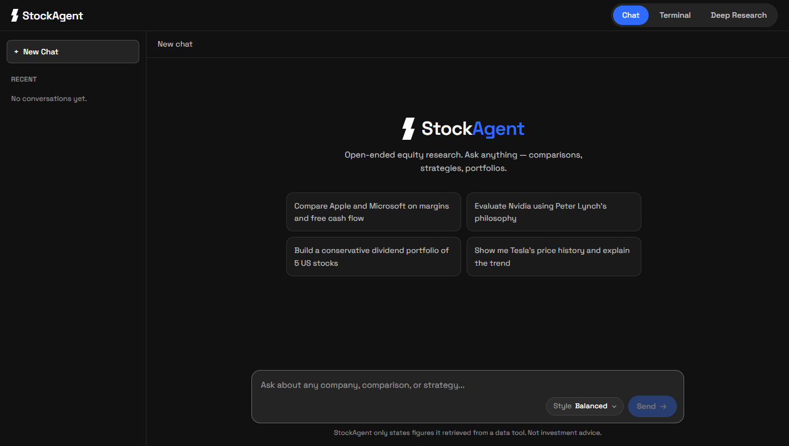
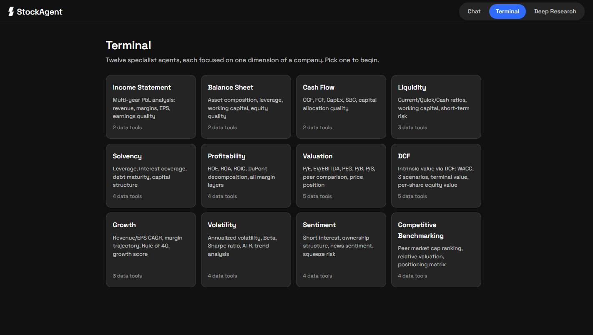
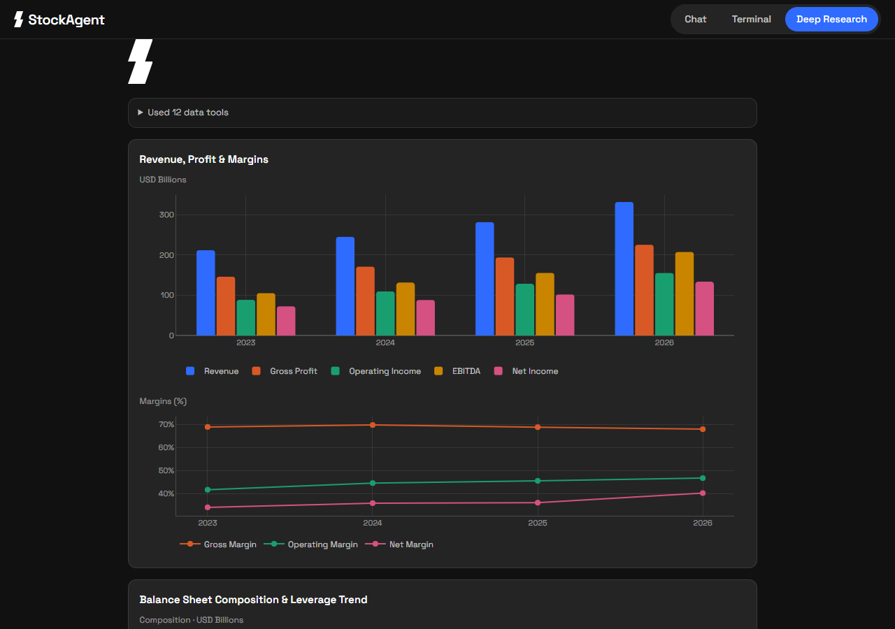

# StockAgent

**AI-powered equity research that streams its work.** Ask about a company and
watch the agent call each data tool, draw the charts, and type out the report —
live, instead of waiting for one block of text at the end.

Three ways in: an open-ended **Chat**, twelve single-purpose **Terminal**
agents, and a two-stage **Deep Research** pipeline that produces a full
investment brief.

<p align="center">
  
</p>

---

## Two principles

**1. Never state a figure it didn't fetch.** Every number in a report comes
from a real tool call, not from the model's memory. This is enforced in the
system prompts and is the reason the tool trace is shown to the user rather
than hidden.

**2. 100% free data sources.** Everything routes through
[OpenBB](https://openbb.co), pinned to free providers (`yfinance`, `sec`) in
each feature's `tool_set/config.py`. No FMP, no Alpha Vantage, no Bloomberg.
That constraint is what makes the product cheap enough to offer at all.

---

## The three modes

| Mode | What it does | Tool usage |
|---|---|---|
| **Chat** | Open-ended, ChatGPT-style research with persistent memory (Postgres). Handles what the others can't: multi-company comparisons, portfolio construction, "evaluate X using Peter Lynch's philosophy". | Non-deterministic — the model picks its own tools, including an explicit `generate_chart` tool. |
| **Terminal** | Twelve specialist agents (DCF, Liquidity, Solvency, Valuation, Growth, Volatility, Sentiment, …). Pick one, give it a company, get a focused report on that dimension. | Deterministic per agent — each always calls its own fixed toolset. |
| **Deep Research** | One query in, one 13-section investment brief out. Stage 1 retrieves everything, stage 2 writes the brief under a chosen risk appetite. | Fully deterministic — all 10 tools, every run. |

**Why three instead of one:** Deep Research and Terminal are valuable *because*
they are repeatable — same company, same tools, same shape of answer. Chat
needs the opposite. Forcing one architecture to do both jobs compromises both.

<p align="center">
  
</p>

---

## Quick start

**Prerequisites:** Python 3.13+ with [uv](https://docs.astral.sh/uv/), Node 20+,
and a PostgreSQL database (only needed for Chat).

```bash
# 1. Install Python dependencies
uv sync

# 2. Configure secrets
cp .env.example .env     # then fill in the values

# 3. Start the backend — FROM THE REPO ROOT
uv run uvicorn backend.main:app --reload         # http://localhost:8000

# 4. Start the frontend — in a second terminal
cd frontend && npm install && npm run dev        # http://localhost:5173
```

Open <http://localhost:5173>. Chat is the default view; the tab bar switches
modes.

Notes:
- The **first backend start takes ~45 seconds** — OpenBB is a heavy import.
  It is not hung.
- The backend **must** run from the repo root, so `deep_research`, `terminal`
  and `chat` resolve as packages.
- Vite proxies `/api/*` to `localhost:8000`, so the browser stays on one
  origin and CORS never enters the picture in development.
- `GET /api/health` reports whether Postgres is reachable.

---

## Configuration

Set these in a `.env` file in the repo root — see [`.env.example`](.env.example)
for the annotated template. **`.env` is gitignored; never commit real keys.**

| Variable | Required | Purpose |
|---|---|---|
| `OLLAMA_API_KEY` | yes | Ollama Cloud — serves every agent model |
| `TAVILY_API_KEY` | yes | Web/news search (falls back to DuckDuckGo on failure) |
| `GOOGLE_API_KEY` | yes | Gemini, used only by the nested `peers_agent` |
| `DATABASE_URL` | Chat only | Postgres via asyncpg; Deep Research and Terminal need no database |
| `CORS_ALLOW_ORIGINS` | no | Extra allowed browser origins, comma-separated |
| `VITE_USER_ID` | no | Frontend only (`frontend/.env.local`) — overrides the dev user id |

---

## Architecture

```
Browser (React + Vite)
   │  POST /api/{mode}/stream        ← fetch-event-source, not EventSource:
   │                                   every stream is a POST with a JSON body
   ▼
FastAPI (backend/)                   ← thin SSE wrapper, no business logic
   │  forwards each event dict verbatim as one SSE message
   ▼
Feature package (deep_research / terminal / chat)
   │  async generator yielding JSON-serializable events
   ▼
LangChain agent .astream_events(v2) → OpenBB (yfinance, sec) · Tavily · Postgres
```

Every entry point (`run_pipeline_stream`, `run_analysis_stream`,
`chat_turn_stream`) is an **async generator of small event dicts**. The backend
adds transport, not behavior — which is why each feature still runs standalone
in a terminal.

### Charts never enter the model's context

Chartable tools use LangChain's `response_format="content_and_artifact"`: the
model sees the normal stringified data, while the same raw object is captured
separately during `on_tool_end` and shaped into Plotly-ready JSON by
`chart_data.py` (pure functions, no I/O).

- **Deep Research & Terminal** batch their charts and emit them *after all tool
  calls finish, before the first report token*.
- **Chat** emits each chart the moment its `generate_chart` call completes,
  interleaved with the reply.

### Deliberate duplication

`tool_set/`, `response_style.py` and `chart_data.py` are **copied** into all
three feature folders rather than shared. Each feature is meant to be
self-contained and independently debuggable, with zero cross-feature imports.
**When you fix shared-looking logic, apply it in all three copies** — the
`chart_data.py` copies are currently byte-identical.

<p align="center">
  
</p>

---

## API

All three stream endpoints are `POST` + Server-Sent Events. Full event tables
live in [`BACKEND_FASTAPI.md`](BACKEND_FASTAPI.md) and
[`backend/README.md`](backend/README.md).

| Endpoint | Body |
|---|---|
| `POST /api/deep-research/stream` | `{ query, response_style, risk_appetite }` |
| `GET /api/terminal/analyses` | — returns the 12-agent catalogue |
| `POST /api/terminal/stream` | `{ analysis_type, company_input, response_style }` |
| `GET /api/chat/conversations` | — sidebar list (needs `X-User-Id`) |
| `GET /api/chat/conversations/{id}/messages` | — full history |
| `POST /api/chat/stream` | `{ conversation_id, message, response_style }` |
| `GET /api/health` | — `{ status, database }` |

```bash
# Watch a stream from the command line (-N disables curl buffering)
curl -N -X POST http://localhost:8000/api/terminal/stream \
  -H "Content-Type: application/json" \
  -d '{"analysis_type":"income_statement","company_input":"Apple"}'
```

**Response Style** maps to temperature in every mode: `precise` 0.1 ·
`balanced` 0.4 (default) · `exploratory` 0.7. **Risk Appetite**
(`conservative` / `moderate` / `aggressive`) applies to the Deep Research brief
only.

---

## Project layout

```
.
├── backend/              FastAPI app — routers, SSE wrapper, auth stub
├── deep_research/        2-stage pipeline (retriever → investment brief)
├── terminal/             12 analysis agents + registry
├── chat/                 1 open-toolset agent + Postgres memory
├── frontend/             React + TypeScript + Vite UI
├── brand_identity/       Brand assets (lockups, symbol, loader, favicon)
├── docs/screenshots/     Images used by this README
├── PROJECT_CONTEXT.md    Design rationale — read this first to contribute
├── BACKEND_FASTAPI.md    Backend spec and SSE event vocabularies
└── FRONTEND_REACT.md     Frontend spec, brand system, chart mapping
```

Each feature folder and the frontend has its own README with detail:
[`deep_research`](deep_research/README.md) · [`terminal`](terminal/README.md) ·
[`chat`](chat/README.md) · [`backend`](backend/README.md) ·
[`frontend`](frontend/README.md).

---

## Development

```bash
# Run a feature standalone, from the repo root (no web UI)
uv run python -m deep_research.agent
uv run python -m terminal.registry
uv run python -m chat.chat_agent

# Frontend
cd frontend
npm run build      # type-check + production build
npm run lint       # oxlint
```

---

## Authentication — dev stub only

**There is no real authentication.** Every request carries a fixed placeholder
`X-User-Id`; the backend falls back to
`00000000-0000-0000-0000-000000000001` when the header is absent or invalid.
Anyone can claim any user id. See `backend/deps.py` and `frontend/src/lib/api.ts`.
Replace this before any deployment — and note that the chat-history endpoints
do not yet check conversation ownership.

---

## Known gaps

Honest status, so nobody assumes these are solved:

- **No auth, no billing.** Out of scope so far (above).
- **Model names differ per feature.** Chat uses `gpt-oss:120b`; Deep Research,
  the Terminal shared runner and two `peers_agent` copies currently say
  `gemma4`. This inconsistency predates the web layer and has never been
  confirmed as intentional — check it before trusting a run.
- **`get_dividend_history` field names are unverified** against a live call, so
  `shape_dividend_history()` may need adjusting.
- **Only some chart types have been rendered against real data** (income
  statement, balance sheet, cash flow, peers). The rest are type-checked and
  build cleanly but haven't been visually confirmed.
- **`get_price_history`'s x-axis is positional** (trading day 1, 2, 3 …), not
  calendar dates. Deliberate — the source has no reliable per-row date field.
  Don't "fix" it without new tooling.
- **Rate limits are the biggest operational risk.** Yahoo Finance throttles
  aggressively; each tool paces itself with a 2-second delay before its
  external call. Upstream model 500s and occasional early-stopping retrievers
  also happen — the UI surfaces both as readable errors.
- **Retrying a failed chat reply** saves the user's message to Postgres twice.
- **The Ollama base URL is hardcoded** (`https://ollama.com`) in each
  `get_model()` factory rather than read from the environment.

---

## License

No license file yet — all rights reserved by default until one is added.
